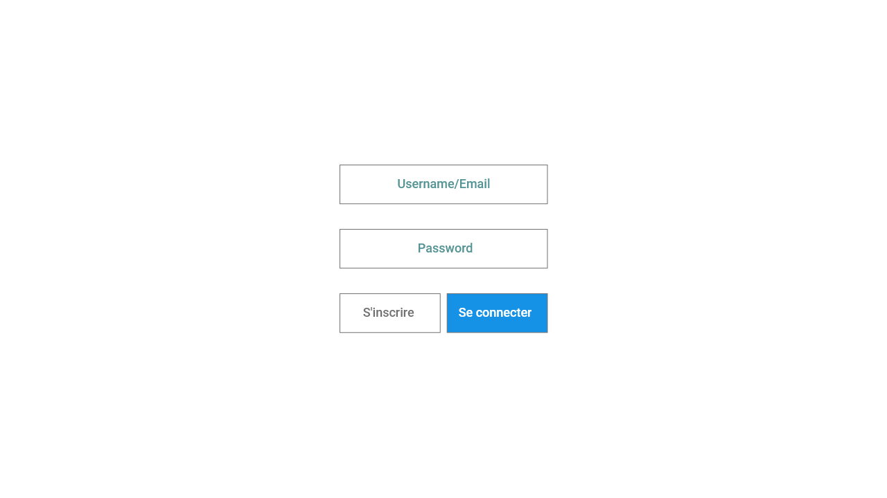
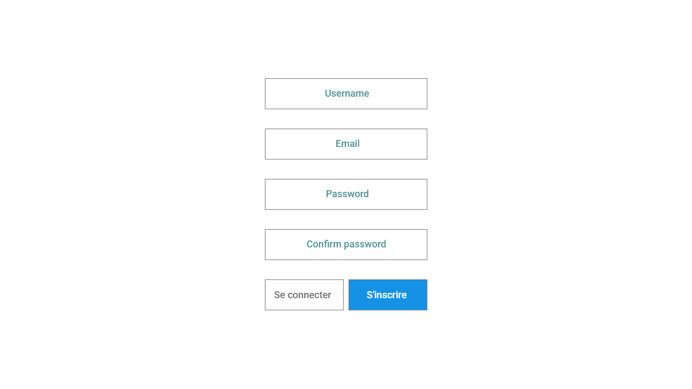

# Exercice 
## 1\ Page de connexion

Créer une page **login.php**, qui permettra à un utilisateur de se connecter sur sa page profil, via ses identifiants stockés en base de données.
Un utilisateur peut se connecter avec son *username* ou son *e-mail*
* Vérification que les champs soient bien saisies
* Affichages des erreurs :
    * Identifiants invalides
    * Champs vide ...

Si les identifiants sont correctes, on redirige l'utilisateur vers **profil.php**.
Un utilisateur ne peut pas accéder à **profil.php** si il n'est pas identifié.

---

## 2\ Inscription

Créer une page **inscription.php** qui permettra à un utilisateur de s'inscrire sur l'application. Quatre champs seront demandés :
1. username (chaînes alphanumérique, aucun caractères spéciaux)
2. email (adresse e-mail valide)
3. password (8 caractères minimun, 1 majuscule, 1 chiffre)
4. confirm password (identique à password)

 

* Vérification que les champs soient bien saisies
* Affichages des erreurs :
    * E-mail invalide
    * Password trop court
    * Username invalide
    * E-mail déjà utilisée
    * Le password doit contenir une majuscule et un chiffre

Si les champs sont bien remplies, on insère les données dans la base de données et on redigire l'utilisateur vers sa page de profil.

*login.php*

    

*inscription.php*

    

*profil.php*

    

